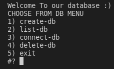

# DBMS_Bashscript-project

[Project Demo](Bash_DBMS_Demo.mp4)

Bash Shell Script Database Management System (DBMS):

The Project aim to develop DBMS, that will enable users to store and retrieve the data from Hard-disk.

The Project Features:
The Application will be CLI Menu based app, that will provide to user this Menu items:
Main Menu:
- Create Database
- List Databases
- Connect To Databases
- Drop Database

Up on user Connect to Specific Database, there will be new Screen with this Menu:
- Create Table 
- List Tables
- Drop Table
- Insert into Table
- Select From Table
- Delete From Table

Hints:
- The Database will store as Directory on Current Script File
- Don't use Absolute Path in your scripts
- The Tables Is Store In files, which can be CSV or JSON or XML File
- You can divide the Table info to two tables: Meta-data and Raw Data in separate files or the same file
- When Create Table, The Meta Data of Table will be: Table Name, Number of Columns, Name Of Columns
- There is assumption that First Column is Primary Key, which used for Delete Rows.
- The Select of Rows displayed in screen/terminal in Accepted/Good Format

### [project.sh](project.sh)

the main project file

### [Test.md](Test.md)

test cases file

### [snippet](/img/)

### Contact Us

### Samah Gaber
[Github](https://github.com/samahgabermohamed)

[Linked in](https://www.linkedin.com/in/samah-gaber-62099b166)

### Sandra Girgis
[Github](https://github.com/sandra-girgis)

[Linked in](https://www.linkedin.com/in/sandra-girgis)
