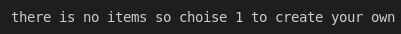
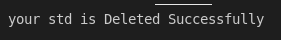

# Tests that i done in the project

if db name is empty , or start with number

if db already exist

db list and number of items in the list

if you created a db that already exist

if you deleted db that isn't exist

if you didn't accept the delete question

if it deleted successfully

if you choised a wrong number that not in the menu

try to connect but there are no tables

if table name is empty , or start with number

if number of columns is empty , or contain a characters

if primary key columns is empty , or contain a numbers

enter the first column that will be your pk and it's type

table created successfully

table list and number of items in the list

if you deleted table that isn't exist

if it deleted successfully

in insert if pk is empty or wrong datatype 
if any column is wrong datatype

if it inserted successfully

if you entered dublicated pk in int

in insert if pk is empty or wrong datatype 
if any column is wrong datatype

if you entered dublicated pk in varchar

if you selected wrong record

if you selected valid record

if you deleted wrong record

if you deleted valid record
